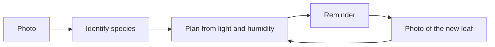

## How it works

```mermaid width=90%
flowchart LR
  A[Photo] --> B[Identify species]
  B --> C[Plan from light and humidity]
  C --> D[Reminder]
  D --> E[Photo of the new leaf]
  E --> C
```

The loop closes itself: every new photo sharpens the plan.
